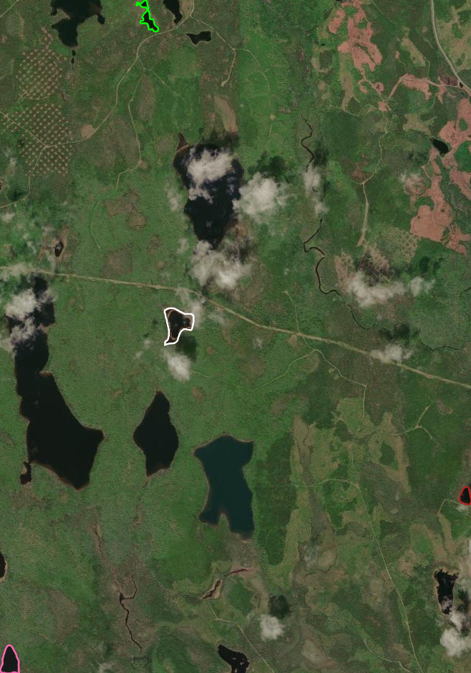

<!-- README.md is generated from README.Rmd. Please edit that file -->

# wkpeek

<!-- badges: start -->

<!-- badges: end -->

The goal of wkpeek is to …

## Installation

You can install the development version of wkpeek like so:

``` r
# FILL THIS IN! HOW CAN PEOPLE INSTALL YOUR DEV PACKAGE?
```

## Example

This is a basic example which shows you how to solve a common problem:

``` r
library(wkpeek)

sql <- "SELECT geometry FROM \"ns-water_water-poly_geo\" WHERE NAME_1 = 'Mud Lake'"
url <- "/vsicurl/https://github.com/geoarrow/geoarrow-data/releases/download/v0.2.0/ns-water_water-poly_geo.parquet"
layerinfo <- vapour::vapour_layer_info(url)
geom <- wk::wkb(vapour::vapour_read_geometry(url, sql = sql), crs = layerinfo$projection$Wkt)

wk_peek(geom[32:35], border = c("hotpink", "green", "firebrick", "white"), lwd = 3)
#> Using zoom level 14
#> Tile grid: 4 x 5 = 20 tiles
#> Fetching 20 tiles ...
```


